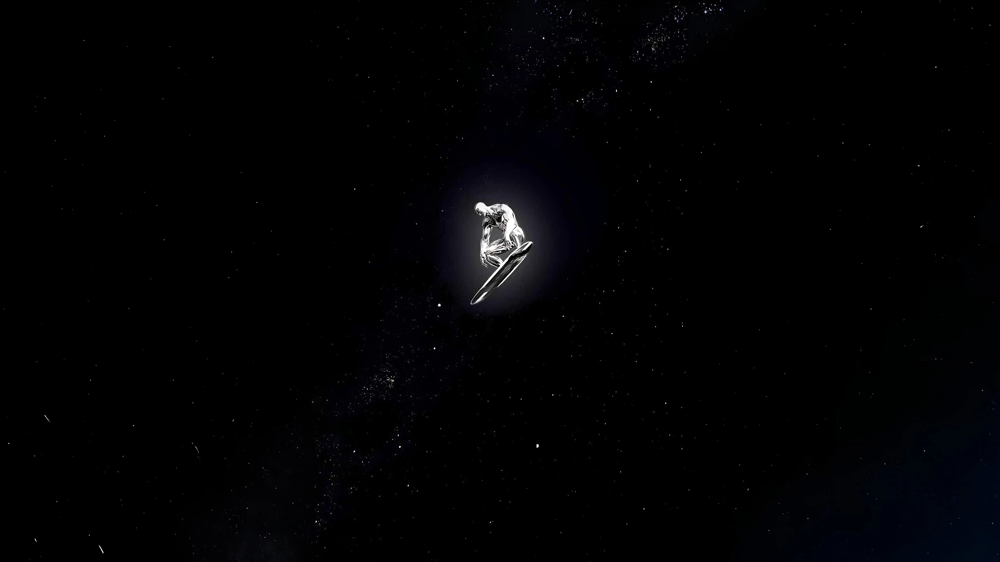
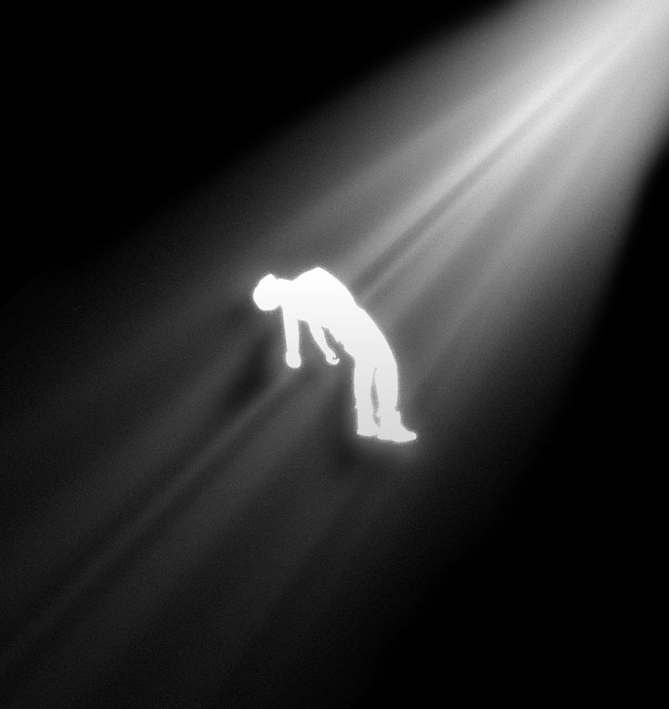
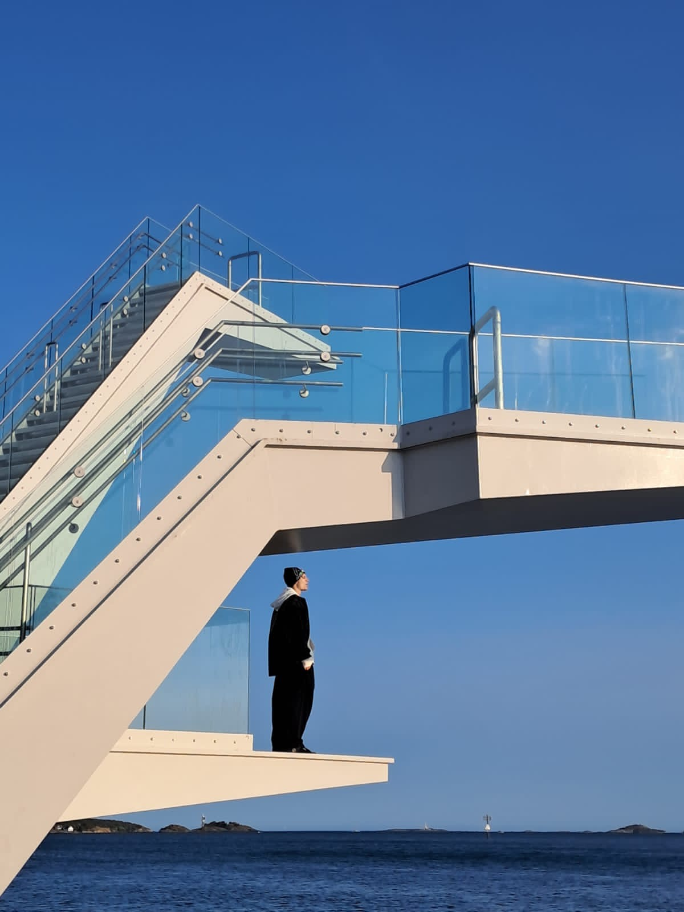

<!-- Subtle Background Texture -->

<!-- Navigation -->
<nav class="main-nav" id="main-nav">
  
SUSINIRGS

  

    
    
    
  

  

    <a href="#hero" class="nav-link active">Inicio</a>
    <a href="#about" class="nav-link">Sobre Mí</a>
    <a href="#music" class="nav-link">Música</a>
    <a href="#videos" class="nav-link">Videos</a>
    <a href="#gallery" class="nav-link">Galería</a>
    <a href="#connect" class="nav-link">Conectar</a>
  

</nav>

<!-- Hero Section -->

  

    

      

        
        

      

    

    

      Artista Independiente
      <h1 class="artist-name">SUSINIRGS</h1>
      

        Trap
        
        Hip-Hop
        
        Producción
      

      

        Creando música que fusiona sonidos oscuros con vibras cósmicas. 
        Cada track es un viaje por dimensiones sonoras inexploradas.
      

      

        <a href="#music" class="btn-primary">
          ▶ Escuchar Ahora
        </a>
        <a href="#about" class="btn-outline">Conocer Más</a>
      

    

  

  

    Descubre
    

  

  
  

<!-- About Section -->

  

    

      Conóceme
      <h2>Sobre Mí</h2>
      

    

    
    

      

        <h3 class="about-title">La Voz del Underground</h3>
        

          <strong>SUSINIRGS</strong> es un artista independiente de Trap y Hip-Hop que fusiona 
          sonidos oscuros con vibras cósmicas, creando una experiencia musical única que trasciende 
          los límites del género.
        

        
        

          

            
🎤

            

              <h4>Estilo Musical</h4>
              
Trap experimental, Hip-Hop alternativo, beats oscuros con toques de misticismo y espiritualidad.

            

          

          
          

            
🌌

            

              <h4>Filosofía Artística</h4>
              
Energía Mística Universal - cada track es un viaje por dimensiones sonoras inexploradas.

            

          

          
          

            
🎬

            

              <h4>Visión Creativa</h4>
              
Producción propia, lírica consciente y visuales cinematográficos. Cada proyecto es una obra completa.

            

          

        

      

      
      

        

          
"

          
La música es el portal hacia otras dimensiones. Cada beat es una frecuencia que conecta almas.

          — SUSINIRGS
        

        

          

            15+
            Proyectos
          

          

            2024
            Activo
          

          

            ∞
            Creatividad
          

        

      

    

  

  
  

<!-- Music Section -->

  

    

      Discografía
      <h2>Mi Música</h2>
      

      
Escucha mis últimos lanzamientos y tracks más populares

    

    
    

      

        

          Spotify
        

        <iframe style="border-radius:12px" src="https://open.spotify.com/embed/artist/78uCfenEleQDaQJM21K2fk?utm_source=generator&theme=0" width="100%" height="400" frameBorder="0" allowfullscreen="" allow="autoplay; clipboard-write; encrypted-media; fullscreen; picture-in-picture" loading="lazy"></iframe>
        <a href="https://open.spotify.com/intl-es/artist/78uCfenEleQDaQJM21K2fk" target="_blank" class="spotify-link">
          Abrir en Spotify →
        </a>
      

      
      

        <h3 class="tracks-title">Proyectos Destacados</h3>
        
        <a href="https://www.youtube.com/watch?v=cB5sIhH067A" target="_blank" class="track-item featured">
          01
          

            Proyecto Más Reciente
            Mi trabajo más fresco y actual
          

          Nuevo
          ▶
        </a>
        
        <a href="https://www.youtube.com/watch?v=zAjGlkn3udw" target="_blank" class="track-item">
          02
          

            Energía Mística Universal
            Vibras cósmicas y espirituales
          

          ▶
        </a>
        
        <a href="https://www.youtube.com/watch?v=uDAziScqsUk" target="_blank" class="track-item">
          03
          

            Video Más Craneado
            El video que más cerebro me voló
          

          ▶
        </a>
        
        <a href="https://www.youtube.com/watch?v=VcEhBUNhPs4" target="_blank" class="track-item">
          04
          

            Data Sagrada
            Información pura y espiritual
          

          ▶
        </a>
        
        <a href="https://www.youtube.com/watch?v=otPFUIPQkIs" target="_blank" class="track-item">
          05
          

            Más Rapero
            Flow puro y lírica real
          

          ▶
        </a>
        
        <a href="https://www.youtube.com/watch?v=J-li4emQsS0" target="_blank" class="track-item">
          06
          

            La Diferencia Es Lo Que Vale
            Proyecto excepcional y único
          

          ▶
        </a>
      

    

  

  
  

<!-- Video Section -->

  

    

      Contenido Visual
      <h2>Videos Musicales</h2>
      

      
Videos oficiales, visualizers y contenido exclusivo

    

    
    

      

        
Destacado

        

          <iframe width="100%" height="315" src="https://www.youtube.com/embed/cB5sIhH067A" title="YouTube video player" frameborder="0" allow="accelerometer; autoplay; clipboard-write; encrypted-media; gyroscope; picture-in-picture; web-share" allowfullscreen></iframe>
        

        

          <h3>Proyecto Más Reciente</h3>
          
Mi trabajo más fresco y actual - El proyecto que define mi evolución artística

          

            Nuevo
            2024
          

        

      

      
      

        

          <iframe width="100%" height="315" src="https://www.youtube.com/embed/uDAziScqsUk" title="YouTube video player" frameborder="0" allow="accelerometer; autoplay; clipboard-write; encrypted-media; gyroscope; picture-in-picture; web-share" allowfullscreen></iframe>
        

        

          <h3>Video Más Craneado</h3>
          
El video que más cerebro me voló hacer

          

            Creativo
          

        

      

      
      

        

          <iframe width="100%" height="315" src="https://www.youtube.com/embed/zAjGlkn3udw" title="YouTube video player" frameborder="0" allow="accelerometer; autoplay; clipboard-write; encrypted-media; gyroscope; picture-in-picture; web-share" allowfullscreen></iframe>
        

        

          <h3>Energía Mística Universal</h3>
          
Proyecto con vibras cósmicas y espirituales

          

            Místico
          

        

      

    

    
    

      <a href="https://www.youtube.com/@susinirgs" target="_blank" class="btn-youtube">
        ▶ Ver Todos en YouTube
      </a>
    

  

  
  

<!-- Gallery Section -->

  

    

      Visual
      <h2>Galería</h2>
      

      
Arte, estética y visuales que definen mi universo creativo

    

    
    

      

Spooky Vibes

      

720pts

      

Arte Visual

      

Libertad

      

Arte I

      

Arte II

      

Arte III

      

Arte IV

      

Cosmic

      

Divino

      

Expresión

      

Crush

    

  

  
  

<!-- Connect Section -->

  

    

      Comunidad
      <h2>Conecta Conmigo</h2>
      

      
Únete a la comunidad y mantente al día con nueva música

    

    
    

      <a href="https://open.spotify.com/intl-es/artist/78uCfenEleQDaQJM21K2fk?si=7O3kEBUITZyZWnRXtJ8bhg" target="_blank" class="social-card spotify">
        
🎵

        Spotify
        Escuchar
      </a>
      <a href="https://www.youtube.com/@susinirgs" target="_blank" class="social-card youtube">
        
▶

        YouTube
        Suscribirse
      </a>
      <a href="https://www.instagram.com/susinirgs/" target="_blank" class="social-card instagram">
        
📷

        Instagram
        Seguir
      </a>
    

    
    

      <h3>¿Listo para sumergirte en el universo SUSINIRGS?</h3>
      
Escucha mi música, ve mis videos y únete a la comunidad

      <a href="#music" class="btn-cta">Empezar a Escuchar</a>
    

  

  
  

<!-- Footer -->
<footer class="footer">
  

    

      

        <h3 class="footer-logo">SUSINIRGS</h3>
        
Trap · Hip-Hop · Producción

        
Artista independiente creando música que trasciende dimensiones. Energía Mística Universal.

      

      
      

        <h4>Navegación</h4>
        <a href="#hero">Inicio</a>
        <a href="#about">Sobre Mí</a>
        <a href="#music">Música</a>
        <a href="#videos">Videos</a>
        <a href="#gallery">Galería</a>
      

      
      

        <h4>Plataformas</h4>
        <a href="https://www.youtube.com/@susinirgs" target="_blank">YouTube</a>
        <a href="https://open.spotify.com/intl-es/artist/78uCfenEleQDaQJM21K2fk" target="_blank">Spotify</a>
        <a href="https://www.instagram.com/susinirgs/" target="_blank">Instagram</a>
      

    

    
    

      

      
© 2025 SUSINIRGS. Todos los derechos reservados.

      
Hecho con pasión por la cultura

    

  

  
  
</footer>
